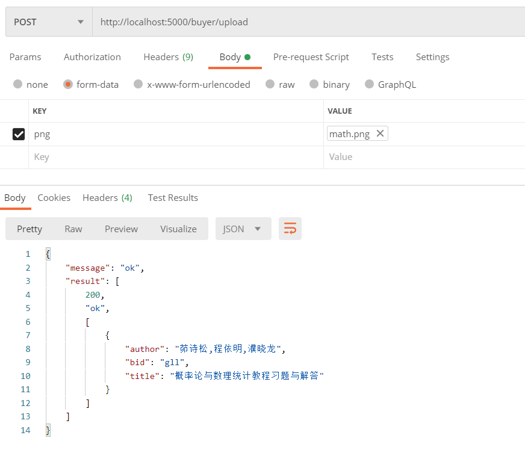
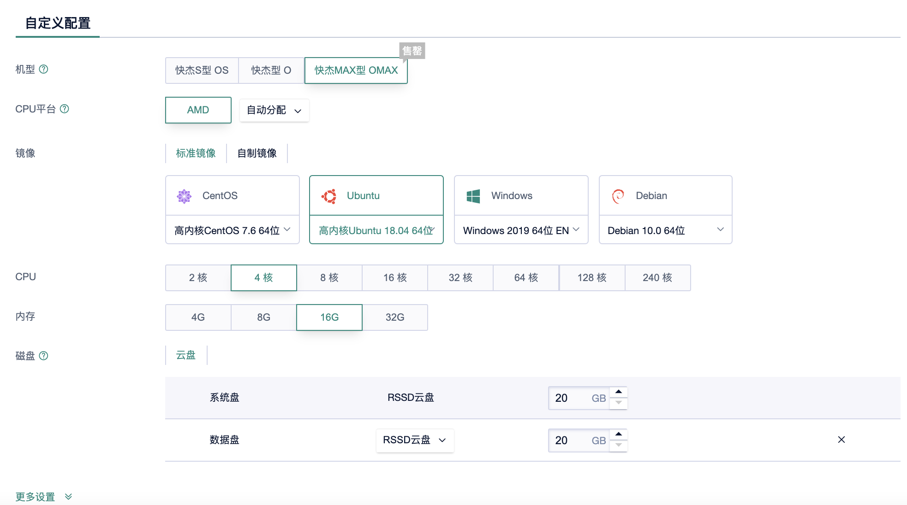

# 数据管理系统作业——Bookstore实验报告

| 课程名称：当代数据管理系统 | 项目名称：bookstore   | 指导老师：周烜 |
| -------------------------- | --------------------- | -------------- |
| **姓名：汤琼**             | **学号：10182100106** | **年级：2018** |
| **姓名：郑佳辰**           | **学号：10182100359** | **年级：2018** |
| **姓名：孙秋实**           | **学号：10185501402** | **年级：2018** |

[TOC]

## 一. 实验要求

实现一个提供网上购书功能的网站后端。
网站支持书商在上面开商店，购买者可能通过网站购买。
买家和卖家都可以注册自己的账号。
一个卖家可以开一个或多个网上商店， 买家可以为自已的账户充值，在任意商店购买图书。
支持下单->付款->发货->收货，流程。

1.实现对应接口的功能，见doc下面的.md文件描述 （60%分数）

其中包括：

1)用户权限接口，如注册、登录、登出、注销

2)买家用户接口，如充值、下单、付款

3)卖家用户接口，如创建店铺、填加书籍信息及描述、增加库存
通过对应的功能测试，所有test case都pass
测试下单及付款两个接口的性能（最好分离负载生成和后端），测出支持的每分钟交易数，延迟等

2.为项目添加其它功能 ：（40%分数）

1)实现后续的流程
发货 -> 收货

2)搜索图书
用户可以通过关键字搜索，参数化的搜索方式； 如搜索范围包括，题目，标签，目录，内容；全站搜索或是当前店铺搜索。 如果显示结果较大，需要分页 (使用全文索引优化查找)

3)订单状态，订单查询和取消定单
用户可以查自已的历史订单，用户也可以取消订单。
取消定单（可选项，加分 +5~10），买家主动地取消定单，如果买家下单经过一段时间超时后，如果买家未付款，定单也会自动取消。

## 二 .项目运行

项目运行前需要先对数据库进行初始化。

在MongoDB中建立名为bookstore的数据库。然后在其中建立两个文档集，文档集名称分别为book和history_order，并按照下述3.5.4中MongoDB的部分建立索引。

PostgreSQL数据库的初始化已在store.py中建立好，无需手动建立。

然后输入以下语句运行项目。

```python
python app.py
```

或根据七.项目上云中的步骤使用云端数据库运行项目。

## 三.数据库设计

### 3.1 总体设计理念

下述设计基于以下合理假设，

1. 用户会频繁下单和付款及取消
2. 用户会经常犯错但一般不会故意犯错
3. 相对于卖家来说，买家的数量更多且权益应受到保护
4. 用户在搜索时对书籍并不了解

为了保证系统功能，并且尽量提高系统的性能，本项目ER图及数据库设计如下所示。

数据库的优化设计在3.5小节。

### 3.2 ER图


### 3.3 关系数据库

项目中大部分内容存储在Postsql关系数据库中。下面将先对关系数据库进行介绍。

经过多次测试，添加了外键、唯一、非空等约束之后的数据库性能大幅降低。所以在程序运行过程中，用代码及错误处理来保证数据库中数据的正确性及合理性。而对于数据库本身不显式添加约束。这样做可以保证数据库的高性能。


#### 3.3.1 users table

* **设计思路**

users表用于存储用户实体类及其属性。表中每一行对应一个用户，记录了其基本属性。

* **表格结构**


**user_id**：string类型，是本表唯一的主键。用于记录用户名。

**password**：string类型。用于记录用户密码的暗文。为了安全性考虑，数据库不存储明文密码。

**balance**：integer类型，初始值为0。用于记录用户账户内的金额。

**token**：string类型。用于记录登录时用户名、时间和终端号生成的标记。在进行重要操作时，需要检查本属性以确定消息来自同一终端。

**terminal**：string类型。用于记录登录时终端号。

#### 3.3.2 user_store table

* **设计思路**

user_store表用于存储商店实体类以及开店联系类。表中每一行为一家店。

* **表格结构**


**user_id**：string类型。用于记录商店的店主的用户名。

**store_id**：string类型，是本表的主键。用于记录商店名。

#### 3.3.3 store table

* **设计思路**

本表用于存储书店的库存信息，表中每行代表一本书在一家商店的库存信息。

* **表格结构**


**store_id**：string类型，是本表的主键之一。用于记录书籍所在的商店名。

**book_id**：string类型，是本表的主键之一。用于记录对应书籍的id。

**stock_level**：integer类型。用于记录书籍的库存数。

**price**：integer类型。用于记录书籍的单价。在不同的商店中，书籍的单价可以不同。

#### 3.3.4 new_order table

* **设计思路**

表格存储订单有关信息，每条记录记录订单中与书籍无关的信息。

* **表格结构**


**order_id**：string类型，是本表的主键。记录了订单的订单号。

**user_id**：string类型。记录了订单买家的用户名。

**store_id**：string类型。记录了订单的商家的商店名。

**status**：integer类型。记录了订单的状态，默认值为1。其中1表示已下单未付款，2表示已付款未发货，3代表已发货未收货，4表示已收货，0表示订单已取消。

**total_price**：integer类型。记录了订单的总价。

**order_time**：integer类型。记录了订单的下单时间，用时间戳的形式表示。用于自动取消等业务。

#### 3.3.5 new_order_detail_table

* **设计思路**

表格存储订单与书籍购买联系类相关详细信息，每条记录记录某订单中购买某本书的信息。

* **表格结构**


**order_id**：string类型，是本表的主键之一。记录了订单的订单号。

**book_id**：string类型，是本表的主键之一。用于记录订单中对应书籍的id。

**count**：integer类型。记录该订单中购买这本书的数量。

#### 3.3.6 invert_index table

* **设计思路**

invert_index table 倒排表用来存储关键词与书籍的索引关系。具体构建及查找在功能中有详细介绍。

* **表格结构**


**search_key**：string类型，倒排表的主键之一。记录了倒排表的主键，当用户输入倒排表中的内容时，本表可返回查找到的书目的信息。

**search_id**：序列类型，倒排表的主键之一。可以根据key的依次插入生成自增的integer序列。用于分页面查询。

**book_id**：string类型。记录了对应书籍的id，是倒排表的返回值之一。

**book_title**：string类型。记录了对应书籍的标题。作为冗余属性返回便于买家查看。

**book_author**：string类型。记录了对应书籍的作者。作为冗余属性返回便于买家查看。

### 3.4 文档型数据库

#### 3.4.1 book collection

* **设计思路**

book collection 用来存储书籍信息，每一个文档对象存储一本书的信息。

* **表格结构**


**id**：string类型。记录书的id，每本书id唯一。

**title**：string类型。记录书的标题，理论上不可为空。

**author**：大部分为string类型，可以为null。记录书的作者。

**publisher**：string类型。记录书的出版社。

**original_title**：大部分为null，非空值为string类型。记录外文书的原标题。

**translator**：大部分为null，非空值为string类型。记录外文书的译者。

**country**：大部分为空，非空值为string类型。记录外文书作者的国籍。

**pub_year**：string类型。记录书的出版年月。

**pages**：Int32类型。记录书的页码数。

**currency_unit**：string类型，可以为空字符串。记录书价格的货币单位。大部分为“元”。

**isbn**：string类型。记录书的ISBN号。

**author_intro**：string类型，可以为空字符串。记录书的作者的简介。

**book_intro**：string类型，可以为空字符串。记录书的简介。

**content**：string类型，可以为空字符串。记录书的目录。

**tags**：array类型，每一项为字符串。记录书的标签和关键字。

**pictures**：array类型，每一项为一张图片。记录书的图片。

#### 3.4.2 history_order collection

* **设计思路**

history_order collection 用来存储历史订单，每一个文档对象记录一条订单记录。

* **表格结构**


**order_id**，**user_id**，**store_id**，**status**，**total_price**，**order_time**：记录的信息与格式与PostgreSQL数据库中的数据完全相同。特别地，status取值只有可能为0和4，即已取消和已收货两种。进行中订单的这部分信息保存于new_order中。

**books**：数组类型，其中数组中每一项是一个子文档。子文档中有**book_id**和**count**两项，其记录了订单中的书籍信息。记录的信息与格式与PostgreSQL数据库中的数据完全相同。进行中订单的这部分信息保存于new_order_detail中。

### 3.5 关系模式优化

#### 3.5.1 表的分裂和合并

由于订单的数量庞大，其中主要是历史订单，进行中的订单数目占总订单数目非常少的一部分。所以将订单表进行分裂，分成已完成的订单和未完成的订单两部分。其中已完成的订单用两张SQL表来记录，而未完成的订单用一个MongoDB文档集来记录。

对于未完成订单来说，由于他要随时对状态进行更新，并且涉及到自动取消等操作。若和历史订单放在一起，则会使查询的复杂度增加。且对于这些订单，经常被访问的是总价，状态等信息，而不常访问new_order_detail中的书籍信息，并且会经常对new_order中的状态进行改动，所以决定采用SQL来进行存储。

而已完成的历史订单几乎不会改动，它的用处主要是用来展示用户的历史订单，这种这样的方式非常适合直接用一个文档来记录。且取出历史订单的另一个任务是用来做推荐，而推荐是需要的信息是购买的书籍信息，如果仍然采用SQL储存的方式，则每次需要取出很多条订单中的书籍记录，导致效率过低等问题。所以历史订单采用了mangoDB来存储。

#### 3.5.2 冗余属性引入

在本次项目中，最重要的冗余属性就是倒排表中的属性。倒排表中的search_key关键字记录的是书籍标题、作者、标签、简介关键词等信息的倒排信息，用这张表可以加速对于书籍的搜索。若倒排表只提供book_id，不在其中增加数据库中冗余的书的标题和作者属性。用户只能通过书的ID再去查找一遍MongoDB的中的书籍信息，这样做不仅效率很低，并且不符合用户习惯。所以将这两个对于书籍比较重要的信息加入到倒排表中作为冗余属性，是符合了用户的搜索习惯，并且提高了效率。

此外，作为推导属性的订单总价也被加入到订单表中。这是因为未完成订单在付款和收货时需要访问订单的总价。如果每次都用其他表中的信息现场计算，则会造成很大的资源浪费。

#### 3.5.3 范式规则

本数据库虽然添加了冗余信息，部分范式化仍然较好。除去倒排索引，本项目的各表符合**BCNF**。

#### 3.5.4 索引创建

本项目涉及两种数据库，分别为Postgresql和MongoDB

##### 3.5.4.1 Postgresql

只用到了主键索引，没有使用其他索引。原因是在建表时已经考虑到了查询等因素，故不建立其他索引也能有较好的表现。

##### 3.5.4.2 MongoDB

为了加快业务速度，对于MongoDB的两张表，我们为其建立了索引

##### Index1(B-tree 索引):书信息表

添加索引的理由：id的索引用于加速查询业务，author、publisher、以及tags的索引用于提高推荐业务的速度。


##### Index2(B-tree 索引):历史订单信息表

添加索引的理由：user_id的索引用于加速买家历史信息查询，user_id的索引用于加速卖家历史信息查询。同时它们还能间接加速推荐业务的速度。


## 四.功能函数


#### 概述

我们分别实现了 auth, seller, buyer 三种角色的业务逻辑，并完成了性能优化及对应接口测试。

功能包括注册，登录，上架图书等**基础功能**；收发货，手动取消订单，查看订单（当前/历史）,（多关键词）搜索等**进阶功能**；此外，我们实现了自动取消订单，以图搜书，实时OCR搜索，小型推荐系统，店铺内搜索等**拓展功能**。

在性能提升方面，我们采取了**RETURNING 关键字**减少了不必要的查询，对应的MongoDB 操作为 FindOneAndUpdate。同时，引入**“软实时”**概念以减小多线程对资源的消耗。

以下是本次项目的**亮点功能**：

4.1.8 推荐系统 / 4.2.2 上架图书 / 4.2.5 查询当前订单 / 4.2.6 查询历史订单 / 4.3.2 下单 / 4.3.3 付款 /  4.3.6 自动取消订单 / 4.3.7 搜索 / 4.3.8 多关键词搜索  / 4.3.9 以图搜书 /  4.3.10 实时 OCR 搜索 /  4.3.11 获取书籍信息 / 4.3.12 店铺内搜索

 ### 事务处理（亮点）

本项目作了较为完善的事务处理，在 UPDATE 和 DELETE 中我们使用了RETURNING关键字，提高了效率，但仍存在如下可能：在更新完或删除完，取出数据之后，系统有可能根据取出的数据判断该操作无法完成，此时必须出现**回滚 rollback**。对于本项目重要功能均是**作为一个事务**完成，在事务结束时，执行 commit 提交。我们对于基础功能，进阶功能等均进行了事务处理，保证了项目正常运行。

### 4.1 用户权限功能

#### 4.1.1 注册

* 功能实现

  1. 根据 user_id 在 users 表中查询用户是否已经存在
  2. 若不存在，则插入新用户 (user_id, password, balance, token, terminal) 到 users 表中

* 性能分析

  一次查询users table，一次插入users table，**访问数据库两次**

#### 4.1.2 登录

* 功能实现

  1. 根据 user_id 在 users 表中获取密码password
  2. 将获取到的 password 与用户输入的密码对比
  3. 更新用户的 token, terminal

* 性能分析

  一次查询 users table, 一次更新 users table，**访问数据库两次**

#### 4.1.3 登出

* 功能实现

  1. 根据 user_id 在 users table 中查询，判断登录信息是否失效
  2. 更新用户 token

* 性能分析

  一次查询 users table，一次更新 users table，**访问数据库两次**

#### 4.1.4 注销

* 功能实现

  1. 根据 user_id 在 users table 中查询该用户是否存在
  2. 删除 users table中该用户条目

* 性能分析

  一次查询 users table, 一次更新 users table ，**访问数据库两次**

#### 4.1.5 更改密码

* 功能实现

  1. 根据 user_id 在 users table 中查询用户原先密码
  2. 判断用户原先密码和用户新密码是否相同
  3. 若不同，则更新 users table 中该用户的 password

* 性能分析

  一次查询 users table, 一次更新 users table，**访问两次数据库**

#### 4.1.6 查询当前订单

* 功能实现

  1. 根据 user_id 在 new_order table 中查询用户所有订单信息
  2. 对于每一个 order_id 在 new_order_detail 中查询书籍信息

* 性能分析

  一次查询 new_order table ，一次查询 new_order_detail table，**访问数据库两次**

#### 4.1.7 查询历史订单

* 功能实现

  1. 根据 user_id 在 MongoDB history_order collection 中查询所有订单信息

* 性能分析

  一次查询 MongoDB history_order collection，**访问MongoDB数据库一次**

#### 4.1.8 推荐系统

推荐系统是本次实验的特色功能之一，实现起来较为复杂，执行的复杂度也比较高。本次的推荐系统利用用户的历史订单信息，对用户进行个性化推荐。推荐系统会给用户推荐与用户的历史购买标签Jarcard相似度较高的书籍进行推荐。

* 功能实现

  1. 首先我们从MongoDB中找出用户的历史订单，其中包括用户购买过的书籍，取出其ID、标题、作者、标签、以及出版社。已经购买过的书籍的推荐权重会被设置为最低。
  2. 利用这些信息寻找与该书籍相似的书籍。从MongoDB数据库中依次找出与用户购买过的某本书籍作者相同、或出版社相同、或拥有相同标签的其他书籍。过程中对已取出的书籍去重，取出其标签等信息备用。
  3. 计算所有取出的书籍与用户的历史购买标签的Jarcard相似度$(Jarcard(A,B)=\frac{|A\cap B|}{|A\cup B|})$并排序，取出top5并将该书籍信息返回给用户。

* 性能分析

  推荐功能需要**访问多次MongoDB数据库**。访问数据库的次数与用户的历史订单数和已购买的图书数正相关。虽然每一次查询均会使用到文档集上建立的索引，但是由于查询比较复杂，时间成本仍然较高。在目前的推荐算法下，如果不利用数据库和索引的话，需要遍历每一本书，以$O(n^2)$时间复杂度或空间复杂度进行推荐。所以合理利用数据库并建立适当的索引可以降低复杂度。
  
  ```python
  eachbook = self.mongo['book'].find_one({'id': boughtbook['book_id']},{'_id': 0, 'id': 1, 'title': 1, 'author': 1, 'tags': 1, 'publisher':1})
  
  books = self.mongo['book'].find({'$or': [{'author': eachbook['author']},{'publisher': eachbook['publisher']},{'tags': {'$elemMatch': {'$in': eachbook['tags']}}}]},{'_id': 0, 'id': 1, 'title': 1, 'author': 1, 'tags': 1})
  ```

（下一个亮点功能是4.2.2）

### 4.2 卖家功能

#### 4.2.1 创建店铺

* 功能实现

  1. 分别在 users table 和 store table 中查询 users_id 和 store_id 是否已经存在
  2. 若不存在，插入用户 user_id 和 store_id 到 user_store table

* 性能分析

  一次查询 users table, 一次查询 store table，一次插入 user_store table，**访问数据库三次**

#### 4.2.2 上架图书

* 功能实现

  1. 检查 user_id，store_id，book_id 是否存在
  2. 根据 book_id 在 Mongodb 的 book  collection 中查询 book 是否存在。若存在，则不需重复加入MongoDB中的book文档集。若不存在，则按下述步骤整理数据。
  3. 将book_json_str转换成字典格式。先根据括号匹配作者字符串，分离出作者名和作者国籍。这是为了防止包含在作者名开头的括号和国籍使倒排表建立不规范。
  4. 然后提取书籍简介、作者简介、目录中的关键词。利用jieba分词中的textrank取出关键词，去重并加入书的标签。
  5. 建立倒排表，将书的标题分词，按照分词结果组成后缀，分离每个后缀的前缀并作为关键字加入倒排表，书的作者、标签等进行类似处理，将这些信息插入倒排表 invert_index table。
  6. 将 (store_id, book_id, stock_level, price) 插入 store table

* 性能分析

  一次查询 users table, 一次查询 user_store table, 一次查询 store table，一次查询 Mongodb 的book collection，一次插入 store table，插入 invert_index table 若干次 ，**至少访问数据库五次**
  
```python
                # ---加入倒排索引开始---
                # 将新书的标题、作者、标签加入倒排索引表
                preffixs = []
                title = book_info_json.get("title")
                preffixs += nlp.get_middle_ffix(title)
                if "author" in book_info_json.keys():
                    names = parse_name(book_info_json.get("author"))
                    for i in range(1,len(names)):
                        preffixs += nlp.get_preffix(names[i])
                    preffixs += nlp.get_preffix(book_info_json.get("author"))
                if "original_title" in book_info_json.keys():
                    preffixs += nlp.get_preffix(book_info_json.get("original_title"))
                if "translator" in book_info_json.keys():
                    names = parse_name(book_info_json.get("translator"))
                    for i in range(1, len(names)):
                        preffixs += nlp.get_preffix(names[i])
                    preffixs += nlp.get_preffix(book_info_json.get("translator"))
                preffixs = list(set(preffixs))
                for preffix in preffixs:
                    self.conn.execute(
                        "INSERT into invert_index(search_key, book_id, book_title, book_author) "
                        "VALUES (:sky, :bid, :til, :asr)",
                        {'sky': preffix, 'bid': book_id, 'til': title, 'asr': author})
                # ---加入倒排索引结束---
```

（下一个亮点功能是4.2.5和4.2.6）

#### 4.2.3 添加库存

* 功能实现

  1. 检查 user_id, store_id,book_id 是否存在
  2. 根据 store_id,book_id 寻找该店家某本书的库存，并在 store table 中更新

* 性能分析

  一次查询 users table, 一次查询 user_store table, 一次查询 store table，一次更新 store table，**访问数据库四次**

#### 4.2.4 卖家发货

* 功能实现

  1. 检查 store_id,book_id 是否存在 
  2. 根据 order_id 在 new_order table 中更新订单状态

* 性能分析

  一次查询 user_store table, 一次查询 store table，一次更新 new_order table，**访问数据库三次**

#### 4.2.5 查询当前订单

* 功能实现

  1. 根据 seller_id 在 new_order 和user_store table 中查询所有订单信息
  2. 对于每一个 order_id 在 new_order_detail 中查询书籍信息

* 性能分析

  一次查询 user table ，一次连接查询 new_order和user_store table，多次查询 new_order_detail table，**访问数据库至少三次**。由于连接查询使用的都是主键，所以性能并不是很差。

```python
 cursor = self.conn.execute(
                "SELECT o.order_id, o.store_id, o.status, o.total_price, o.order_time "
                "FROM new_order o, user_store s "
                "WHERE s.user_id = :user_id AND s.store_id = o.store_id ",
                {"user_id": seller_id, })
```

#### 4.2.6 查询历史订单

* 功能实现

  1. 根据 store_id 在 MongoDB history_order collection 中查询店铺所有订单信息

* 性能分析

  一次查询 MongoDB history_order collection，**访问MongoDB数据库一次**
  

```python
orders = self.mongo['history_order'].find({'store_id': store_id}, {'_id': 0})
```

（下一个亮点功能是4.3.2和4.3.3）

### 4.3 买家功能

#### 4.3.1 充值

* 功能实现

  1. 根据  user_id 获取用户密码
  2. 将用户密码与用户输入的密码做对比
  3. 若密码一致，则更新该用户在 users table 中的余额

* 性能分析

  一次查询 users table，一次更新 users table，**访问数据库两次**

#### 4.3.2 下单

* 功能实现

  1. 检查 user_id, store_id 是否存在
  2. 根据订单信息（store_id，book_id）在 store 表中查找商户中是否存在对应书籍和足够的库存。
  3. 若库存足够，则更新 store table 库存。此时发现，需要取出的信息仅有price单价。库存属性可以在更新时进行判断，如果没有符合条件的行，则不会更新。这样一来，我们就可发现使用一个select语句在store表中执行时查询效率较低，因为在之后还有一个对同一行的更新语句。这时候我们可以使用**RETURNING**关键字将更新后的结果直接返回。这里就是返回price即单价。如此通过一次更新操作和RETURNING关键字实现两次访问数据库的效果，这样便减少节省了时间。在取消或完成订单时的DELETE操作也使用了RETURNING关键字。
  4. 创建新订单信息，将 (order_id, book_id, count, price) 插入 new_order_detail table
  5. 创建该笔订单，计算该笔订单总价 total_price，将 (order_id, store_id, user_id, total_price, order_time) 插入 new_order table，同时将订单号 order_id 添加到 unpaid_order 数组

  ```python
   cursor = self.conn.execute(
         "UPDATE store set stock_level = stock_level - :count "
         "WHERE store_id = :store_id and book_id = :book_id and stock_level >= :count "
         "RETURNING price",
         {"count":count, "store_id":store_id, "book_id":book_id, "count":count})
  ```

* 性能分析

  一次查询 users table, 一次查询 user_store table，一次更新 store table，一次插入 new_order_detail table， 一次插入  new_order table，**访问数据库五次**。与不使用RETURNING相比少了一次查询 store table。

#### 4.3.3 付款

* 功能实现

  1. 根据 order_id 在 new_order table 中查询订单信息
  2. 查询订单是否超时
  3. 若订单未超时，则根据 buyer_id 在 users table 中获取买家余额和密码
  4. 根据 store_id 在 user_store table 中查询卖家 seller_id
  5. 在 users table 中更新买家的余额
  6. 在 new_order table 中更新订单状态 status=2

* 性能分析

  一次查询 new_order table, 一次查询 users table, 一次查询 user_store table, 一次更新 users ，一次更新 new_order table，**访问数据库五次**。本业务通过删除不必要的查询来加速执行。
  

（4.3.6及之后均为本项目亮点，望您拨冗查阅）

#### 4.3.4 买家收货

* 功能实现
  1. 根据 order_id 在 new_order table 中查询对应的订单状态，买家 id
  2. 检查订单状态是否为已发货，订单id与买家id是否对应
  3. 若符合条件，则更新卖家余额，更新订单状态为已收货并且加入历史记录

* 性能分析

  一次查询 new_order table，一次查询 user_store table，两次更新 users table，一次查询 users table，**访问数据库五次** 

#### 4.3.5 手动取消订单

* 功能实现

  1. 根据 order_id 在 new_order table 中查询订单状态是否为已下单
  2. 检查用户是否存在，订单号是否存在
  3. 从全局 unpaid_orders 字典中删除该订单
  4. 根据 order_id 从 new_order table 中删除该订单，从 new_order_detail table 中删除订单信息
  5. 根据 store_id 和 book_id 回滚库存 stock_level
  6. 将订单信息加入MongoDB的历史记录 history_order collection 中

  ```python
  cursor = self.conn.execute(
  "DELETE FROM new_order WHERE order_id = :order_id RETURNING order_id, user_id, store_id ,total_price, order_time ", {"order_id": order_id, })
  
  cursor = self.conn.execute(
  "DELETE FROM new_order_detail WHERE order_id = :order_id RETURNING book_id, count ",{"order_id": order_id, })
  ```

* 这里我们采取了RETURNING 关键字减少了不必要的查询
  (1) 同时进行SELECT 和UPDATE 操作
  (2) 作用于INSERT,UPDATE,DELETE
  (3) DELETE 返回操作前的数据，INSERT,UPDATE 返回操作后的数据
  对应的MongoDB 操作：FindOneAndUpdate

* 性能分析

  一次查询 new_order，一次删除 new_order table，多次删除 new_order_detail ，一次更新 store table，一次插入 MongoDB history_order collection，**共访问至少五次数据库**

#### 4.3.6 自动取消订单

自动取消订单运用了一种“软实时”的思想

* 功能实现

  1. 维护一个全局字典，用来记录每个订单的起始时间（下单时间）
  2. 使用datetime等时间工具记录用户下单时的时间，存储于全局列表
  3. 利用Apscheduler调度器，实现每30分钟检查一次全局列表中订单的状态
  4. 若订单未超时，不做出任何动作，若被检查到超时，取消这笔订单。在用户下单时，会再次确认支付时间。

* 性能分析

  这是一种类似“软实时”的订单状态维护方法，可以将超时取消功能的开销降低很多。不专门起一个线程“盯着”用户的订单，而是每一个周期检查一次，取消掉被检查到超时的订单。在用户下单时，会再次检查是否超时，若超时则直接取消这笔订单。

实现方式：

```python
time_limit = 30 # 订单存活时间
unpaid_orders = {}
```

使用一个全局字典记录订单时间状况，并设定未付款订单的最大存活时间

```python
#优点：通过维护全局数组to_be_paid，没有额外新启线程，代价降到最低
def add_unpaid_order(orderID):
    unpaid_orders[orderID] = get_time_stamp()
    print("add successfully")
    print(unpaid_orders)
    return 200, "ok"
def delete_unpaid_order(orderID):
    try:
        unpaid_orders.pop(orderID)
        print(unpaid_orders)
    except BaseException as e:
        return 530, "{}".format(str(e))
    return 200, "ok"
def check_order_time(order_time):
    cur_time = get_time_stamp()
    time_diff = cur_time - order_time
    if time_diff > time_limit:
        return False
    else:
        return True
```

每当删除任务的周期到来，就对全局字典执行一次探查，将未在指定时间付款的订单状态改为“取消”

```python
def time_exceed_delete():
    del_temp=[]
    o = Order()
    print("new cycle start")
    for (oid,tim) in unpaid_orders.items():
        if check_order_time(tim) == False:
            del_temp.append(oid)  # remenber, not to append the index of the array, we need the orderID
    for oid in del_temp:
        delete_unpaid_order(oid)
        o.cancel_order(oid)
    return 0
```

通过配置一个apscheduler调度器来执行定时任务

```python
class Config(object):
    JOBS = [
        {
            'id': 'soft_real_time',
            'func': '__main__:time_exceed_delete',
            'trigger': 'interval',
            'seconds': 30,#30s仅作为测试用时，实际使用中应将其设为30mins
        }
    ]
```

#### 4.3.7 搜索

搜索功能主要基于倒排表实现，并且有分页搜索和不分页搜索两种形式。

* 功能实现

  1. 先从用户处读入搜索的关键字和是否需要分页及页码，如参数page等于零，则不分页。如page等于其他数字则为用户需查找的页码。
  2. 如不需要分页，则从倒排表中查出该关键字对应所有书籍的ID、标题以及作者，并整理成合适形式返回给用户。
  3. 如需要分页，则先利用SQL关键字中的order by给search_id升序排序、再用limit限制每页中的结果数，最后用offset关键字偏移取出对应页面的查询结果。整理成合适形式返回给用户。

  ```python
   cursor = self.conn.execute(
                  "SELECT book_id, book_title, book_author from invert_index "
                  "where search_key = '%s' "
                  "ORDER BY search_id limit '%d' offset '%d';"
                  % (search_key, self.page_size, page_lower))
  ```

* 性能分析

  由于倒排表的存在，单关键字搜索只需**访问一次数据库**，且由于search_key和search_id为该倒排表的主键，上建有聚簇索引，所以查询速度非常快。

#### 4.3.8 多关键词搜索

多关键词搜索查询的结果是单关键字搜索结果的并集。

* 功能实现

  1. 先从用户处读入本次搜索的关键字列表。
  2. 对于每个关键字进行单关键字搜索，结果存入列表。并同时利用字典实现去重。
  3. 将经过去重的结果整理成合适形式返回给用户。

* 性能分析

  多关键词搜索需访问X次数据库，X为关键词的个数。由于关键词数目往往有限，可以认为**访问O(1)数量级次数的数据库**。

#### 4.3.9 以图搜书

* 功能实现

1. 我们调用了百度OCR的API来进行图书搜索，具体操作方法如下所示（以概率论与数理统计为例），我们尝试调用OCR功能在书库中检索这本书。


2. 我们先通过 OCR 技术提取图片中的文字，以文本信息返回，再通过 **TextRank** 算法提取文本中的**关键词**，包括title，author 等信息，以此为 key 在 invert_index **倒排表**中进行搜索，单关键字搜索只需**访问一次数据库**，得到书籍名称及相关信息，且由于search_key和search_id为该倒排表的主键，上建有聚簇索引，所以查询速度非常快。

* TextRank 提取关键词结果


3. 定义OCR方法

```python
    def OCR_pic(self, path):
        try:
            print(path)
            image = get_file_content(path)
            # 调用通用文字识别, 图片为本地图片
            res = client.general(image)
            print(res)
            text = []
            for item in res['words_result']:
                print(item['words'])
                text.append(item['words'])
            print(text)
            text_Seg = []
            text_len = len(text)
            doc = ""
            for i in range(0, text_len):
                doc += text[i]
            print(doc)
            sentence_Seg = ana.textrank(doc)
            # sentence_Seg = str(sentence_Seg)
            # sentence_Seg = sentence_Seg.strip(',')
            print(sentence_Seg)
            b = Buyer()
            result = b.search_many(sentence_Seg)
        except sqlalchemy.exc.IntegrityError as e:
            return 528, "{}".format(str(e))
        except BaseException as e:
            return 530, "{}".format(str(e))

        return 200, "ok", result
```

* 测试及测试结果

  可以直接使用postman等测试工具上传图片，提取封面文本，分词后搜索，返回书籍信息。




#### 4.3.10 实时 OCR 搜索

**Remark：需要摄像头功能（最好光线充足) **

```python
APP_ID = '14544448'
API_KEY = 'yRZGUXAlCd0c9vQj1kAjBEfY'
SECRET_KEY = '**********************'
# 初始化AipFace对象
client = AipOcr(APP_ID, API_KEY, SECRET_KEY)
```

需要自己获得一个授权，以调用百度OCR的API

```python
class OCR(db_conn.DBConn):
    def __init__(self):
        db_conn.DBConn.__init__(self)
    def OCR_pic_cv(self):
        try:
            #获取图片
            saveDir = 'data/'
            '''
            调用电脑摄像头来自动获取图片
            '''
            if not os.path.exists(saveDir):
                os.makedirs(saveDir)
            count = 1  # 图片计数索引
            cap = cv2.VideoCapture(0)
            width, height, w = 640, 480, 360
            cap.set(cv2.CAP_PROP_FRAME_WIDTH, width)
            cap.set(cv2.CAP_PROP_FRAME_HEIGHT, height)
            crop_w_start = (width - w) // 2
            crop_h_start = (height - w) // 2
            print('width: ', width)
            print('height: ', height)

            ret, frame = cap.read()  # 获取相框
            frame = frame[crop_h_start:crop_h_start + w, crop_w_start:crop_w_start + w]  # 展示相框
            # frame=cv2.flip(frame,1,dst=None) 
            cv2.imshow("capture", frame)
            action = cv2.waitKey(1) & 0xFF
            time.sleep(3)
            cv2.imwrite("%s/%d.jpg" % (saveDir, count), cv2.resize(frame, (224, 224), interpolation=cv2.INTER_AREA))
            print(u"%s: %d 张图片" % (saveDir, count))
            count += 1
            cap.release()  # 释放摄像头
            cv2.destroyAllWindows()  # 丢弃窗口

            #ocr图片获取图片文字
            path='./data/1.jpg'
            image = get_file_content(path)
            # 调用通用文字识别, 图片为本地图片
            res = client.general(image)

            print(res)

            result = []
            for item in res['words_result']:
                print(item['words'])
                result.append(item['words'])

            print(result)

        except sqlalchemy.exc.IntegrityError as e:
            return 528, "{}".format(str(e))
        except BaseException as e:
            return 530, "{}".format(str(e))

        return 200, "ok", result

```

调用该函数后返回，把封面对准摄像头即可提取书本封面文本（最好可以等待五秒），返回书籍信息，其中对关键词的搜索查询的结果是单关键字搜索结果的并集。


#### 4.3.11 获取书籍信息

本功能对于买家非常重要，用于查看书的简介。然原项目提供的接口中未给出，故列入亮点功能。

* 功能实现
  
1. 根据 bid_list 里的每一个 bid 在 MongoDB book collection 中查找书籍信息

* 性能分析

  一次查询 MongoDB book collection，**访问数据库一次**

```python
book = self.mongo['book'].find_one({'id': bid},{'_id':0})
```

#### 4.3.12 店铺内搜索

店铺内搜索与单关键字搜索类似，但需要使用连接查询。店铺内搜索也有分页搜索和不分页搜索两种形式。

* 功能实现

  1. 先从用户处读入搜索的关键字、商店名和是否需要分页及页码，如参数page等于零，则不分页。如page等于其他数字则为用户需查找的页码。
  2. 如不需要分页，则从倒排表中查出书号与该关键字对应且在该商店中的，所有书籍的ID、标题以及作者，同时从store表中查找出价格和库存，最后整理成合适形式返回给用户。
  3. 如需要分页，依然利用上述原理进行分页，整理成合适形式返回给用户。

  ```python
  cursor = self.conn.execute(
   "SELECT i.book_id, i.book_title, i.book_author, s.price, s.stock_level "
   "from invert_index i, store s "
   "where i.search_key = '%s' and i.book_id = s.book_id and s.store_id = '%s' "
   "ORDER BY i.search_id limit '%d' offset '%d' ;"
   % (search_key, store_id, self.page_size, page_lower))
  ```

* 性能分析

  店内搜索只需**访问一次数据库**。虽然使用了连接查询，但由于用于筛选的属性都为对应表的主键，均建有聚簇索引，所以查询的复杂度并不高。


## 五. 版本控制

#### 活跃branch: improve


#### 活跃branch: modification


## 六. 测试

### 6.1 利用pytest和coverage测试和评估代码

如下图所示，本项目覆盖率在90%左右

* #### coverage test 代码覆盖率评估


### 6.2 吞吐量&延迟测试

以下为吞吐量及延迟测试的结果，可见效果理想，吞吐量维持在**40,000**左右，延迟约为 **0.01**。


### 6.3 测试接口&样例

#### 6.3.1 测试结果

基础测试35个全部通过，除此之外，我们为**进阶功能**编写了37个测试，也全部通过


#### 6.3.2 测试样例

* 发货 send_books

| 测试情况         | 传参                             | 结果 message |
| ---------------- | -------------------------------- | ------------ |
| 付款后发货成功   | 正确store_id，正确的order_id     | code == 200  |
| 未付款无法发货   | 正确store_id，错误状态的order_id | code != 200  |
| 发货不存在的书   | 错误的book_id                    | code != 200  |
| 发货不存在的订单 | 错误的order_id                   | code != 200  |
| 店铺不存在       | 错误的store_id                   | code != 200  |

* 收货 receive_books

| 测试情况                 | 传参                               | 结果 message |
| ------------------------ | ---------------------------------- | ------------ |
| 付款成功且发货成功后收货 | 正确的buyer_id,password,order_id   | code == 200  |
| 未付款订单               | 正确的buyer_id，错误状态的order_id | code != 200  |
| 买家不存在               | 不存在的buyer_id                   | code != 200  |
| 订单不存在               | 不存在的order_id                   | code != 200  |

* 手动取消订单 cancel

| 测试情况             | 传参                    | 结果 message |
| -------------------- | ----------------------- | ------------ |
| 下单后未付款取消订单 | 正确的buyer_id,order_id | code == 200  |
| 买家不存在           | 不存在的buyer_id        | code != 200  |
| 订单不存在           | 不存在的order_id        | code != 200  |

* 搜索 search

| 测试情况            | 传参            | 结果 message |
| ------------------- | --------------- | ------------ |
| 分页查询            | ("三毛", 0)     | code == 200  |
| 全部显示查询        | ("三毛", 1)     | code == 200  |
| 不存在的关键词      | ("三毛+", 1)    | result==[]   |
| 空页                | ("三毛", 1000)  | result==[]   |
| 不存在的关键词+空页 | ("三毛+", 1000) | result==[]   |

* 多关键词搜索

| 测试情况           | 传参                     | 结果 message |
| ------------------ | ------------------------ | ------------ |
| 查询成功           | ["三毛","袁氏"]          | code == 200  |
| 查询成功           | ["三毛", "袁氏", "心灵"] | code == 200  |
| 含不存在关键词查询 | ["三毛","袁氏++"]        | code == 200  |
| 不存在关键词       | ["三毛+","袁氏++"]       | result==[]   |

* 买家查询当前订单

| 测试情况                 | 传参           | 结果 message                    |
| ------------------------ | -------------- | ------------------------------- |
| 下单后查询当前订单       | 正确的buyer_id | code == 200                     |
| 发货后查询当前订单       | 正确的buyer_id | code == 200                     |
| 收货后查询当前订单，为空 | 正确的buyer_id | result==['NO Processing Order'] |

* 买家查询历史订单

| 测试情况               | 传参           | 结果 message |
| ---------------------- | -------------- | ------------ |
| 下单后查询历史订单，空 | 正确的buyer_id | result == [] |
| 发货后查询历史订单，空 | 正确的buyer_id | result == [] |
| 收货后查询历史订单     | 正确的buyer_id | code == 200  |

* 推荐系统

| 测试情况                     | 传参           | 结果 message |
| ---------------------------- | -------------- | ------------ |
| 未下单，无历史订单，推荐为空 | 正确的buyer_id | code == 200  |
| 推荐成功                     | 正确的buyer_id | code == 200  |

* 卖家查询当前订单

| 测试情况                 | 传参            | 结果 message                    |
| ------------------------ | --------------- | ------------------------------- |
| 付款后查询当前订单       | 正确的seller_id | code == 200                     |
| 发货后查询当前订单       | 正确的seller_id | code == 200                     |
| 收货后查询当前订单，为空 | 正确的seller_id | result==['NO Processing Order'] |

* 买家查看历史订单

| 测试情况               | 传参           | 结果 message |
| ---------------------- | -------------- | ------------ |
| 下单后查询历史订单，空 | 正确的store_id | result == [] |
| 发货后查询历史订单，空 | 正确的store_id | result == [] |
| 收货后查询历史订单     | 正确的store_id | code == 200  |

* 获取书籍信息

| 测试情况        | 传参                | 结果 message   |
| --------------- | ------------------- | -------------- |
| 查询成功        | buy_book_id_list[0] | code == 200    |
| 不存在的book_id | buy_book_id_list[0] | book_title==[] |

* 店铺内查询

| 测试情况     | 传参                           | 结果 message |
| ------------ | ------------------------------ | ------------ |
| 查询成功     | 正确的store_id,search_key,page | code == 200  |
| 分页查询成功 | 正确的store_id,search_key,page | code == 200  |

## 七. 项目上云

### 项目在云服务器上部署

需要的云服务有：

1. Ucloud Postgres UDB/阿里云RDS（关系型数据库，选择Postgres）
2. Ucloud MongoDB/阿里云MongoDB（文档型数据库）
3. UHost云服务器/阿里云服务器

Remarks：目前各大云服务厂商的文档型数据库价格昂贵（而且少有学生优惠），建议选择阿里云的MongoDB serverless版本（可以理解为共享的经济适用版文档型数据库），如果对大量用户访问有较高的响应速度要求。建议额外使用云服务商提供的**Load Balance（负载均衡）**服务。

**需要达到相对理想的测试结果，建议按照以下配置设置云服务：**

#### 1.云主机设置



高并发测试需要带宽的支持，目前的Ucloud按**带宽计费**相对昂贵，**量力而行**！


### 2.云关系数据库设置


**Attention！一定要在租好的阿里云服务器白名单上添加自己当前/云服务器的ip地址！否则无法连接上服务器（而且会抛出“wrong password”的错误。）**

通过navicat将Sqlite数据格式转换为csv，再将csv数据全部导入云数据库后（本项目从豆瓣爬下的书本信息约5GB）可以进行简单的查询确认数据正常，如下图所示（**不要直接在Navicat Premium用Export Wizard导出Sqlite数据到Postgres**，这是不对的。）

**Remark：可以通过ip.cip.cc快速获得本机当前ip地址，方便云服务的使用**


随后通过psycopg2库连接上关系型数据库即可，可以先建立简单连接测试是否与云端对接正常。

```python
import psycopg2
Base = declarative_base() #base类
engine = create_engine('postgresql://${username}:${password}@${public ip}:${port}/${databse-name}')
DBSession = sessionmaker(bind=engine)  # 建立会话
bookstore_engine = DBSession()
```

### 3.文档型数据库

云MongoDB的部署和关系型数据库类似，部署时同样注意白名单问题。


## 八. 分工与协作

(1) **郑佳辰：**数据库设计，推荐系统，倒排表及搜索系统，历史订单，性能优化，接口测试，产品经理

贡献度：33.3%

(2) **孙秋实：**订单自动取消，基本功能实现，接口测试，吞吐量测试，项目上云，slides 制作  贡献度：33.3%

(3) **汤琼：** 接口测试，基本功能实现，收发货功能实现，订单取消，以图搜书，实时 OCR，postman测试，吞吐量测试   贡献度：33.3%


## 九. 实验结论

​		本次实验囊括了从表设计到项目各功能封装与测试，再到部署上云的全过程，是一次非常完整的项目开发经历。在Bookstore项目的开发中，本小组加深了对**范式、表索引、倒排索引、数据冗余、高并发与事务处理**的理解，并尝试了使用开放的api完成项目所需的进阶功能。我们花费了大量时间在项目性能优化上，引入了以“订单自动取消”为范例的“软实时”概念以减小多线程对资源的消耗以及如RETURNING关键字减少了不必要的查询。本项目组成员对Bookstore的各个功能共进行了72个测试（35个基础测试+自行编写的37个进阶功能测试），并借此测试了高并发性能与代码覆盖率，都取得了令人满意的成果。


